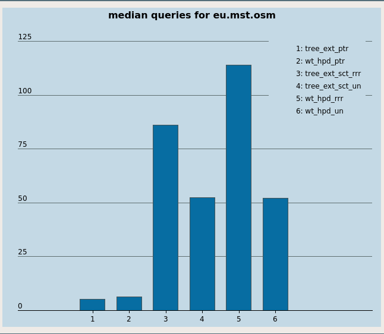
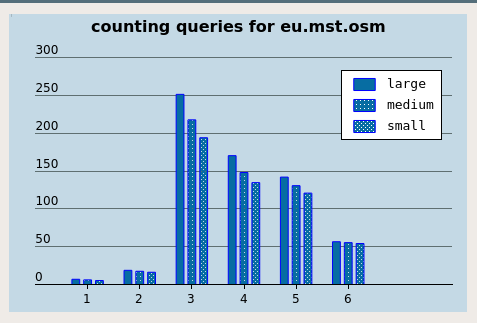

# Tree Path Queries
=========

What is it?
-----------
This library realizes the theoretical findings in published reasearch on path queries in weighted trees. It implements both
plain pointer-based as well as succinct data structures.

Requirements
------------

The library requires:

* A modern, `C++17` ready compiler such as `g++` version 5 or higher or `clang` version 5 or higher.
* The [cmake][cmake] build system.
* A 64-bit operating system. 

### How to build the experiments with pre-generated queries
The target `aggregate_bench` benchmarks _all_ the data structures
against the supplied dataset, for the given query type and (when applicable --
for counting and reporting) parameter K.
The target is defined in `CMakeLists.txt` inside
`${PROJECT_SOURCE_DIR}/src/benchmarking/utils`.
To build: 
```sh
cmake from ${PROJECT_SOURCE_DIR}/build 
```
and then 
```sh
make aggregate_bench
```
### Perl script for running a benchmark
A wrapper around `aggregate_bench` is a Perl script `complete_queryset_benchmark.pl`.
```sh
perl complete_queryset_benchmark.pl <regex> <dataset_path> <num_of_queries> <K> <output_file_name>
```
where 
	* `<regex>` is a regular expression that is recognized by `googletest/googlebench`,
		which can be `tree_ext_ptr_reporting` for the `tree_ext_ptr` data structure
		in the above set, and `reporting` is the type of query;
		if one is willing to run all data structures
		for, say, `counting`, then one would simply omit the data structure part
		altogether and simply say `counting`;
	* `<dataset_path>` is the absolute path of a `*.puu`-file
	* `<num_of_queries>` is the number of queries to generate
	* `<K>` parametrizes the weight-range
	* `<output_file_name>` is a `json` filename to store the results
		- note however that specifying the output filename does not suppress `stdout`

### <a name="cli">Commandline interface</a>
To get a quick idea about the performance of a _single_ data structure,
on a given dataset, and for the given type of query (and again,
when applicable, for given `K`), one can also build
`cli_bench` target defined in 
`${PROJECT_SOURCE_DIR}/src/benchmarking/utils`.
The program is run from commandline with flags:
* `--dataset_path=` absolute path to the dataset
* `--query_type=` one of 
	+ `median` 
	+ `counting`
	+ `reporting`
* `--data_structure=` one of 
	+ `nv`
	+ `nv_lca`
	+ `nv_sct`
	+ `ext_ptr`
	+ `whp_ptr`
	+ `ext_sct_un`
	+ `ext_sct_rrr`
	+ `whp_un`
	+ `whp_rrr`
* `--K=` any positive integer, but typically `1`,`10`,`100` to replicate what we dubbed as 
	+ `large`
	+ `medium`
	+ `small`
Launched with the above flags set, the program instantiates the given data structure over the given
dataset and then measures the query time for the given type of query.


Documentation
-------------

Installation
------------

#### TODO
	[] install script
	[] uninstall script

Getting Started
------------

## Building the library
We use [cmake](`CMake`) as build system. The global `CMakeLists.txt` in the root
directory performs setup steps, such as finding necessary packages [gtest](`gtest`), [SDSL](`sdsl`), etc.
Directories sometimes have `CMakeLists.txt` of their own,
such as e.g. test targets in `${PROJECT_SOURCE_DIR}/src/test/`.
Building the library is a matter of (out-of-source build):
```sh
mkdir build && cd build && cmake ../
```
followed by `make <target>`, where `<target>` is target name defined in one `CMakeLists.txt`s.

### Input file format
For simplicity, at this point our data structures
accept the tree in the following format 
	- a balanced parentheses-encoding of the topology; and 
	- the weights in preorder.
We give such a file an extension `*.puu`.
#### TODO
	[] enable constructors accepting `std::istream &amp`; and
	[] read/write in binary format

### Sample program
To get you started with the library you can start by compiling the following
sample program which constructs a succinct tree extraction-based
data structure and counts the number of nodes on the path from `0` to `n/2`
with weight in `(a+b)/2` to `b`, where `a` and `b` are min/max weights in the supplied tree.

```cpp
#include "tree_ext_sct.hpp"
#include "pq_types.hpp"
#include <fstream>
#include <memory>
#include <string>

// all of these are essentially td::uint64_t
using node_type= pq_types::node_type;
using size_type= pq_types::size_type;
using value_type= pq_types::value_type;

int main() {
	std::string s;
	std::cin >> s; // read the topology -- BP sequence
	std::vector<value_type> w(s.size()/2); 
	for ( auto &x: w ) std::cin >> x; // read the weights
	auto a= *(std::min_element(w.begin(),w.end())), b= *(std::max_element(w.begin(),w.end()));
	// the constructor accepts topology and weights
	auto processor= std::make_unique<tree_ext_sct<node_type,size_type,value_type>>(s,w);
	// execute a counting query
	std::cout << processor->count(0,n/2,(a+b)/2,b) << std::endl;
}
```

### Generating a tree, uniformly at random
Sometimes, generating a binary tree uniformly at random comes in handy. For that, there is a target `gentree`
based on [this paper][GENTREE].
The syntax is as follows:
```sh
./gentree -n=42 -a=1 -b=10
```
outputs to `stdout` the tree in the above `*.puu` format.
`gentree`'s source is `${PROJECT_SOURCE_DIR}/src/misc/gentree_uar.cpp`.

#### TODO
	[] add a commandline flag -- the output file (with default being `stdout`)


Test
----

To ensure that all data structures behave as expected, we created a large 
collection of unit tests which can be used to check the correctness of the library on your computer.
The [test](./test) directory contains test code. We use [googletest][GTEST]
framework and [make][MAKE] to run the tests. 
See the README file in the directory for details.

Benchmarks
----------
## <a name="median">Path median queries</a>

### Running the random query-set
In order to recreate the experiment, build `mgui` target first.
Then,
1. Launch `mgui`
2. `File->Open` and load the dataset
3. Choose the query type `median`
4. Select the data structures in checkboxes
5. Enter the number of queries
6. Press `Execute`
	- Select which file to put the results into (`*.json`)

### <a name="medvis">Visualizing the results</a>
In order to plot a histogram for the `path median`,
select `File->Plot` and then pick the resulting (`*.json`).
One should get an image such as 

## Path counting amd reporting queries
Everything works the way it does for [path median queries](#median),
except for that in step 3, one chooses `counting` and can optionally
choose the configurationbinary  (i.e. the `K` parameter discussed e.g. when
describing [the commandline interface](#cli).

### Group bars
In addition to to visualizing as in the [path median experiment](#medvis),
one can also draw a plot to observe the query-time dynamics as the 
configuration changes. For that, one needs to have run the experiment with
all the structures of interest, for all `K` (see the `Configuration` panel of the GUI).
The one selects `Fil->Group bars` and then using `Ctrl` selects
the files pertaining to the different values of `K`. Let's say we have run
an experiment on counting queries, using a certain dataset, and put
the results in `resultK001.json`, `resultK010.json`, and `resultK100.json`.
Then selecting these (with `Ctrl` pressed) would result in an image with group bars, breaking down
the performance of each data structure by the configuration.
One should get an image such as
 


Bug Reporting
------------

While we use an extensive set of unit tests and test coverage tools you might
still find bugs in the library. We encourage you to report any problems with
the library via the [github issue tracking system](https://github.com/simongog/sdsl-lite/issues)
of the project.

Licensing
---------

The library is free software provided under the GNU General Public License (GPLv3). 
For more information see the [COPYING file][CF] in the library directory.

We distribute this library freely to foster the use and development of advanced data structures. 
A preliminary version of the paper this code primarily used in is available [here on arxiv][SEAPAPER].

## External Resources used in the library
We use the 
* [sdsl][SDSL] for our succinct data structures
* [googletest][GTEST] framework to provide unit tests
* [google-benchmark][GBENCH] for time measurements
* [malloc\_count][MCNT] for measuring space occupancy
* [gflags][GLFAGS] to define and handle commandline flags for CLI interface
For optional functionality, we also use
* [json][JSON] for ease of reporting
* [sha512][SHA512] to facilitate the sanity check of the data structures
	- by creating a hash of the answers to the queries in the query set
In addition, we have GUI based on 
* [Qt][QT]; and
* [QCustomPlot][QCUSTOMPLOT] library for plotting

The GUI functionality is currently work in progress.

Authors
--------

The main contributors to the library are:
* [Serikzhan Kazi](https://github.com/serkazi) (Creator)

Contribute
----------

Are you working on a new or improved implementation of a path queries data structure?
We encourage you to contribute your implementation to the our library to make
your work accessible to the community within the existing library framework.
Feel free to contact any of the authors or create an issue on the
[issue tracking system](https://github.com/serkazi/tree_path_queries/issues).


Caveats
------------
[sdsl-lite][SDSL] stable version that is recommended for
academic purposes (such as this project) comes with its own version of [gtest][GTEST], which can be way too old
for our tests, which use newest (as of time of writing) features of the latter.
(Such as e.g. value-parametrized tests).
This may result in problems when trying to test data structures depending on
`sdsl` (i.e. which link to `sdsl`). The workaround is to disable building
`gtest` inside `sdsl` -- e.g. via appropriate edits inside `CMakeLists.txt` of `sdsl` 
distribution. Essentially, one can to comment-out the lines pertaining
to building `gtest` as an external project and use `cmake`'s `find_packge/find_library` instead
(pointing to your `gtest` distribution if necessary).


[STL]: http://www.sgi.com/tech/stl/ "Standard Template Library"
[cmake]: http://www.cmake.org/ "CMake tool"
[MAKE]: http://www.gnu.org/software/make/ "GNU Make"
[gcc]: http://gcc.gnu.org/ "GNU Compiler Collection"
[clang]: https://clang.llvm.org/docs/
[LS]: http://www.sciencedirect.com/science/article/pii/S0304397507005257 "Larson &amp; Sadakane Algorithm"
[MCNT]: https://github.com/bingmann/malloc_count "malloc_count"
[GTEST]: https://code.google.com/p/googletest/ "Google C++ Testing Framework"
[SDSLCS]: http://simongog.github.io/assets/data/sdsl-cheatsheet.pdf "SDSL Cheat Sheet"
[SDSLLIT]: https://github.com/simongog/sdsl-lite/wiki/Literature "Succinct Data Structure Literature"
[TUT]: http://simongog.github.io/assets/data/sdsl-slides/tutorial "Tutorial"
[CF]: https://github.com/simongog/sdsl-lite/blob/master/COPYING "Licence"
[SEAPAPER]: https://arxiv.org/submit/3022354/view "Path Query Data Structures in Practice"
[DOXYGENDOCS]: http://algo2.iti.kit.edu/gog/docs/html/index.html "API Reference"
[GBENCH]: https://github.com/google/benchmark "Google Benchmark Micro-Benchmarking Framework"
[SHA512]: http://www.atwillys.de/content/cc/swlib-cc/include/sw/hash/sha512.hh "Open-Source implementation of SHA512"
[QCUSTOMPLOT]: "https://www.qcustomplot.com/" "QCustomPlot Qt library"
[QT]: https://www.qt.io/ "Qt"
[SDSL]: https://github.com/simongog/sdsl-lite "sdsl-lite"
[GLFAGS]: https://github.com/gflags/gflags "glfags"
[JSON]: https://github.com/nlohmann/json "JSON for Modern C++"
[GENTREE]: http://www.cs.otago.ac.nz/staffpriv/mike/Papers/RandomGeneration/RandomBinaryTrees.pdf "Generating binary trees at random"
